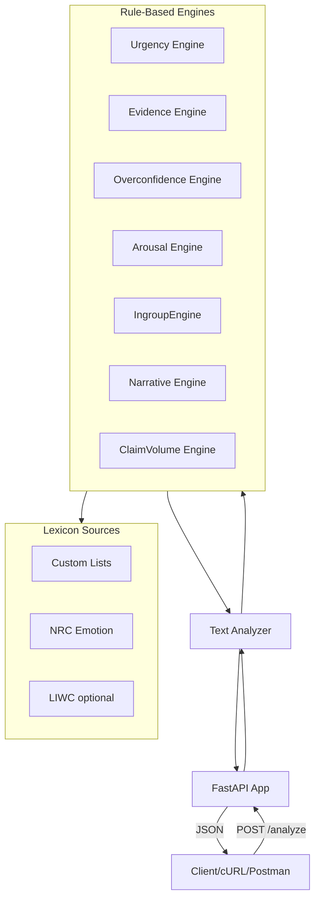

# Engagement Bait API - Rule-Based System Plan

## Architecture Overview




---

## 1. Project Structure

```
EngagBaitAPI/
├── app/
│   ├── __init__.py
│   ├── main.py              # FastAPI app, routes
│   ├── models.py            # Pydantic request/response schemas
│   ├── analyzers/
│   │   ├── __init__.py
│   │   ├── base.py          # Base analyzer interface
│   │   ├── urgency.py
│   │   ├── evidence.py
│   │   ├── overconfidence.py
│   │   ├── arousal.py
│   │   ├── ingroup.py
│   │   ├── narrative.py
│   │   └── claim_volume.py
│   └── lexicons/
│       ├── __init__.py
│       ├── custom/          # Curated word lists
│       │   ├── urgency.txt
│       │   ├── absolutist.txt
│       │   ├── hedging.txt
│       │   └── ...
│       └── nrc.py           # NRC Emotion Lexicon loader (if using)
├── tests/
├── requirements.txt
├── README.md
└── .env
```

---

## 2. API Design (Stripe Track Optimized)

**Primary endpoint:** `POST /analyze`

- **Request:** `{ "text": "..." }` (min ~50 chars, max ~50k chars)
- **Response:** All 7 metrics with sub-scores, HTTP 200

**Optional:** `GET /health` for liveness; `GET /` with API overview + link to docs.

**Response schema (scores 0–1, higher = more engagement-bait-like):**

```json
{
  "urgency_pressure": { "score": 0.72, "breakdown": { "time_pressure": 0.8, "scarcity": 0.6, "fomo": 0.75 } },
  "evidence_density": { "score": 0.15, "breakdown": { "citations": 0, "stats": 0.2, "external_sources": 0.1 } },
  "overconfidence": { "score": 0.85, "breakdown": { "absolutist": 0.9, "strong_modals": 0.8, "hedging_absence": 0.85, "predictive_unqualified": 0.8 } },
  "arousal_intensity": { "score": 0.7, "breakdown": { "emotion_words": 0.75, "exclamation_density": 0.6, "moralized_language": 0.8 } },
  "ingroup_outgroup": { "score": 0.65, "breakdown": { "us_them_markers": 0.7, "tribal_language": 0.6 } },
  "narrative_simplification": { "score": 0.8, "breakdown": { "binary_connectors": 0.85, "single_cause": 0.9, "tradeoff_absence": 0.7, "conditional_absence": 0.75 } },
  "claim_volume_vs_depth": { "score": 0.6, "breakdown": { "claims_per_word": 0.65, "explanation_depth": 0.55 } }
}
```

---

## 3. Rule-Based Engines (Per Metric)


| Metric                       | Sub-metrics                                                            | Rule logic                                                                                                                                                          |
| ---------------------------- | ---------------------------------------------------------------------- | ------------------------------------------------------------------------------------------------------------------------------------------------------------------- |
| **Urgency Pressure**         | time_pressure, scarcity, fomo                                          | Pattern match against curated lists ("act now", "limited time", "last chance", "don't miss") + time-urgency phrases                                                 |
| **Evidence Density**         | citations, stats, external_sources                                     | Regex for `[1,2]`, `(Source: X)`, URLs, "according to", "study shows"                                                                                               |
| **Overconfidence**           | absolutist, strong_modals, hedging_absence, predictive_unqualified     | Count absolutist terms ("always", "never", "guaranteed"), strong modals ("must", "will"), absence of "may/might/could", predictive claims without "likely/probably" |
| **Arousal Intensity**        | emotion_words, exclamation_density, moralized_language                 | NRC high-arousal emotions (anger, fear) + custom moral terms ("wrong", "evil", "traitor"), `!` count / word count                                                   |
| **In-group/Out-group**       | us_them_markers, tribal_language                                       | "we/they", "us/them", demonizing nouns, tribe labels                                                                                                                |
| **Narrative Simplification** | binary_connectors, single_cause, tradeoff_absence, conditional_absence | "either/or", "X is the reason", lack of "however/although/trade-off", lack of "if/when/unless"                                                                      |
| **Claim Volume vs Depth**    | claims_per_word, explanation_depth                                     | Heuristic: sentence count with claim indicators vs word count; depth = avg sentence length, presence of "because/since"                                             |


---

## 4. Lexicon Strategy (Hybrid)

- **Custom lists:** Curated `.txt` files for urgency, absolutist, hedging, binary connectors, single-cause markers, moralized language. Start lean (~20–50 terms each), expand during testing.
- **NRC Emotion Lexicon:** Public dataset for arousal/emotion word mapping. Use anger, fear, disgust categories for arousal; exclude low-arousal (sadness, trust) or weight by arousal.
- **LIWC:** Optional stretch; requires license for some versions. Can defer to post-hackathon.

---

## 5. Implementation Order

1. **Scaffold** – FastAPI app, `/analyze` stub, Pydantic schemas
2. **Lexicons** – Load custom lists + NRC (if chosen), helper to load/cache
3. **Engines** – Implement analyzers 1–7 (urgency first as template)
4. **Integration** – Wire all engines, normalize sub-scores to 0–1, aggregate
5. **Validation & errors** – 422 for invalid input, 400 for empty/oversized text, clear error messages
6. **README + OpenAPI** – Usage examples, cURL/Postman samples; FastAPI auto-generates `/docs` and `/redoc`

---

## 6. Stripe Track Alignment


| Requirement              | Approach                                                        |
| ------------------------ | --------------------------------------------------------------- |
| Queryable over HTTP      | `POST /analyze` returns JSON                                    |
| Operational on localhost | `uvicorn app.main:app --reload`                                 |
| Documentation            | README + auto OpenAPI at `/docs`                                |
| Error handling           | Pydantic validation, HTTP 422/400, informative messages         |
| Beyond GET               | POST for analysis (stateful in spirit: analysis creates result) |
| Developer experience     | Clear request/response schema, copy-paste cURL examples         |


---

## 7. Open Questions / Decisions

- **NRC Lexicon:** Use NRC Emotion Lexicon (public) or keep arousal purely custom for speed?
- **Text length:** Enforce min 50 chars, max 50k? (Adjust based on typical use.)
- **Normalization:** Per-document (raw counts → 0–1 via min-max over doc) vs fixed thresholds. Recommendation: fixed thresholds per sub-metric (e.g., ≥3 absolutist terms → 0.8) for predictability.

